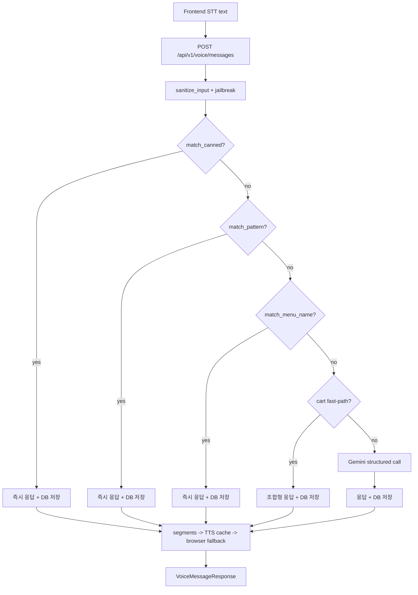

# 음성 주문 파이프라인 정리

이 문서는 현재 백엔드 기준(2026-04-15) **음성 주문(Voice Order)** 기능이
어떻게 진행/처리되는지(세션/단계/stage, 시나리오, AI 호출, TTS/조합형 음성)를 정리한다.

---

## 1. 전체 흐름 한 장 요약

음성 주문은 아래 순서로 처리된다.

1) 프런트가 세션을 만들고(POST /sessions), 음성 주문을 시작한다(POST /voice/start)
2) 사용자가 말한 텍스트(STT 결과)를 POST /voice/messages 로 보낸다
3) 백엔드는 빠른 규칙 기반 처리(시나리오/패턴/메뉴명)를 먼저 시도하고,
   매칭되지 않으면 Gemini(구조화 JSON) 호출로 넘어간다
4) 매 턴(user/assistant) 대화는 DB(chat_messages)에 저장되며, 다음 턴의 AI 컨텍스트로 다시 전달된다
5) 응답 음성은 (1) audio_segments 조합형 캐시가 있으면 조각을 이어붙여 만들고,
  없으면 (2) 설정에 따라 response_text 전체 TTS 캐시를 시도한 뒤,
  둘 다 없으면 (3) 프런트 브라우저 TTS로 폴백한다

Mermaid(개략):



---

## 2. 상태 모델(세션/attempt/stage)

### 2.1 KioskSession의 음성 주문 상태
- 세션 테이블: kiosk_sessions
- 음성 주문 필드
  - voice_persona: voice 퍼소나(elderly/child/general/unknown)
  - voice_current_stage: 현재 대화 단계(stage)
  - voice_attempt_started_at: 현재 진행 중인 음성 주문 시도(attempt)의 시작 시각

핵심은 **session_uuid 1개 안에서 attempt(voice_attempt_started_at)가 유지되는 동안**
대화가 “한 세션”으로 이어진다는 점이다.

### 2.2 attempt_started_at(대화 이력 그룹 키)
chat_messages 테이블은 같은 kiosk_session 안에서도 여러 번의 대화를 구분하기 위해
attempt_started_at을 함께 저장한다.

- 같은 session_id + attempt_started_at + purpose 조합이 한 번의 음성 주문 대화 묶음
- Gemini 호출 시, 이 attempt의 이전 대화를 history로 전달

추가 방어 로직
- /voice/start가 여러 번 호출되어도 **진행 중 attempt가 있으면 재사용(멱등)**
- attempt_started_at이 미세하게 달라져 이력 조회가 0건이 되면, 같은 session/purpose의 최신 이력으로 폴백

---

## 3. Stage(단계) 정의

Stage는 voice 주문의 “대화 진행 상태”를 뜻한다.

- greeting
- category_browse
- menu_browse
- menu_select
- option_select
- cart_review
- payment_confirm
- farewell

Stage 갱신은 AI 응답의 next_stage에 의해 이루어진다.

---

## 4. API 엔드포인트(Voice)

Prefix: /api/v1

### 4.1 POST /voice/start
역할
- 음성 주문 시도(attempt) 시작
- persona 결정 및 인사말(greeting) 반환
- greeting을 DB에 assistant 메시지로 저장(다음 턴 컨텍스트용)

중요 동작(멱등)
- 이미 voice_attempt_started_at이 있으면 새 attempt를 만들지 않고 그대로 반환

### 4.2 POST /voice/messages
역할
- 사용자 발화(text)를 받아 AI 응답 생성
- fast path(규칙) → Gemini 순으로 처리
- user/assistant 메시지를 DB에 저장
- 응답 음성(audio_b64)을 가능한 경우 같이 반환

### 4.3 GET /voice/messages
역할
- 현재 attempt의 대화 이력 조회(페이지네이션)

### 4.4 POST /voice/tts
역할
- 텍스트 → (디스크 캐시 또는 설정에 따라 라이브 TTS) WAV 반환
- 캐시 미스면 404 → 프런트 브라우저 TTS로 폴백

### 4.5 POST /voice/end
역할
- 진행 중인 attempt 종료(voice_attempt_started_at=None)

---

## 5. 처리 파이프라인 상세(process_chat_message)

음성 주문 처리는 범용 함수 process_chat_message에서 이루어지고,
process_voice_message는 purpose="voice_order"를 고정해서 호출하는 얇은 래퍼다.

### 5.1 입력 정제 + jailbreak 차단
- sanitize_input: STT 특유의 잡음을 정리(공백/구두점/제어문자 등)
- check_jailbreak: 프롬프트 인젝션/탈옥 패턴 방지

### 5.2 fast path 0: 시나리오 매뉴얼(canned)
- 정의 파일: backend/data/canned_responses.json
- 매칭 함수: match_canned(text, stage)
- 특징
  - stage + 정규식으로 즉시 응답(AIChatResponse) 반환
  - Gemini 호출 없이 빠르게 처리

대표 시나리오(요약)
- greet_general: 인사
- ask_recommend: 추천 요청
- affirm / deny
- cancel(주문 전체 취소) — 패턴을 좁혀 오탐을 줄임
- help / repeat / wait
- category_coffee / category_tea / category_smoothie / category_ade 등(카테고리 선택)

### 5.3 fast path 1: 패턴 매칭(matcher)
- 목적: 아주 잦은 짧은 발화를 Gemini 없이 처리
- 취소(cancel)는 stage/문구에 따라 보수적으로 처리
  - greeting/category_browse 또는 “전체/전부/주문”이 명시된 경우만 end_conversation
  - 그 외에는 “지금 선택 취소 vs 주문 전체 취소”로 되물음

### 5.4 fast path 2: 메뉴명 직접 매칭
- menu_names(DB) 목록을 TTL 캐시로 가져와
- 사용자 발화에 메뉴명이 포함되면 즉시 메뉴 상세로 navigate
- STT 오차를 고려해 공백/구두점 제거 정규화 후 부분 매칭
- 별칭 지원: 아아/뜨아/아샷추/뜨샷추 등

### 5.5 fast path 3: 장바구니 요약/총액(조합형 audio_segments)
- stage가 cart_review/payment_confirm이고 cart_snapshot이 있을 때
  - “총액/합계/얼마/가격/금액/계산” → cart_total
  - “요약/정리/장바구니 뭐” → order_summary_simple
- response_text와 함께 audio_segments도 구성해 반환

### 5.6 slow path: Gemini structured output
- history: DB에서 list_messages_for_context로 최근 이력 로드(글자 수 기준)
- system_prompt: persona + stage + stage_context + cart_snapshot 등을 조합
- Gemini 응답은 JSON 스키마로 강제하고, 파싱 후 AIChatResponse로 변환

### 5.7 저장/상태 갱신
- user/assistant 메시지를 chat_messages에 저장
- assistant 메시지는 response_metadata에 구조화 응답 전체를 저장(재현/분석용)
- next_stage/end_conversation에 따라 kiosk_sessions의 음성 상태 갱신

---

## 6. 시나리오/템플릿/조각(조합형 음성)

### 6.1 fragments(조각)
- 정적 조각: “ 총 ”, “ 원입니다.” 같은 짧은 단위
- include_menus/include_options가 true면 DB 메뉴명/옵션명도 조각으로 포함 가능

목표
- audio_segments가 있을 때, 조각 WAV를 이어붙여 더 빠르게/일관되게 음성 생성

### 6.2 templates(템플릿)
templates는 text(문장)과 parts(조각 시퀀스)를 함께 가진다.

예)
- menu_selected
  - text: “{menu} 선택하셨어요. 옵션을 골라주세요.”
  - parts: ["{menu}", " 선택하셨어요. 옵션을 골라주세요."]

parts에 들어가는 “정적 문자열”만 미리 합성해 두면 되도록 설계돼 있다.

---

## 7. TTS / 오디오 생성 정책

### 7.1 응답에서 audio_b64가 만들어지는 순서
Voice 응답은 가능한 경우 audio_b64(WAV base64)를 인라인으로 포함한다.

우선순위
1) response.audio_segments가 있으면, 조각 WAV를 디스크 캐시에서 읽어 이어붙이기
2) 실패/없으면 response_text 전체를 TTS 캐시에서 찾기(또는 설정에 따라 라이브 합성)
3) 둘 다 없으면 audio_b64=None → 프런트 브라우저 TTS 폴백

예외(segments-only 모드)
- 환경변수: VOICE_AUDIO_SEGMENTS_ONLY=true
- 의미: (2) 전체문장 TTS 캐시/라이브 합성을 **건너뛰고**,
  (1) 조각 합성이 실패하면 즉시 audio_b64=None으로 반환해 브라우저 TTS로 폴백한다.

운영 의도
- 조각 말뭉치(audio_segments)의 커버리지를 높여 “서버 TTS 호출”을 최소화하고,
  조각 캐시 미스 시에는 클라이언트(브라우저) TTS로 빠르게 폴백한다.

### 7.2 캐시
- 디스크 캐시: backend/data/tts_cache
- 메모리 LRU 캐시: 최근 텍스트 몇 개는 메모리에 유지

옵션
- GENAI_TTS_ENABLED=true면 캐시 미스 시 Gemini TTS를 호출해 WAV를 저장할 수 있음

---

## 8. 로그/메트릭(운영 관찰 포인트)

Voice 엔드포인트는 아래 로그를 남긴다.
- [voice-metrics] audio_source=segments|tts|none|error
- endpoint=start/messages, stage, matched_by, 처리시간(ms)

이 로그로 “조합형이 실제로 쓰이고 있는지(segments 비율)”를 객관적으로 확인할 수 있다.

---

## 9. 검증(Verification) 방법

### 9.1 오프라인 분기 검증(DB 없이)
- 실행

```powershell
backend\.venv\Scripts\python.exe backend\scripts\verify_voice_pipeline.py
```

확인 포인트
- 취소/전체취소 분기
- 메뉴명 매칭 및 audio_segments 채움

### 9.2 서버 스모크 테스트(HTTP)
중요: 현재 임포트 구조상, 서버는 backend 폴더에서 실행하는 것이 안전하다.

```powershell
cd backend
.\.venv\Scripts\python.exe -m uvicorn main:app --host 127.0.0.1 --port 8000
```

- /health 확인
- DB가 정상이라면 /api/v1/kiosks → /api/v1/sessions → /api/v1/voice/start → /api/v1/voice/messages 순으로 확인

### 9.3 캐시 커버리지 점검(조합형 음성 준비 정도)
- 정적 조각/템플릿 조각이 tts_cache에 얼마나 있는지 측정

```powershell
backend\.venv\Scripts\python.exe backend\scripts\audit_tts_cache_coverage.py
```

---

## 10. 관련 파일 맵(빠르게 찾기)

- Voice API: backend/api/v1/endpoints/voice.py
- 처리기(파이프라인): backend/services/chat_service.py
- 시나리오/템플릿/조각/오디오조합: backend/services/canned_responses.py
- 시나리오 정의(JSON): backend/data/canned_responses.json
- 매칭(패턴/메뉴): backend/services/chat_prompts/matcher.py
- 정제/탈옥 방지: backend/services/chat_prompts/jailbreak.py
- 프롬프트(시스템/스테이지/컨텍스트): backend/services/chat_prompts/*
- 대화 저장/조회: backend/crud/chat.py
- 검증 스크립트: backend/scripts/verify_voice_pipeline.py

---

## 11. 현재 설계의 의도(왜 이렇게 나눴나)

- 응답 지연 최소화
  - 자주 나오는 발화는 canned/matcher로 즉시 처리
  - Gemini는 “정말 필요한 경우에만” 호출

- 대화 연속성 보장
  - 매 턴 DB 저장 + 다음 턴 history 전달
  - /voice/start 멱등성으로 attempt가 불필요하게 끊기지 않게 함

- 음성 합성 비용/쿼터 대응
  - 캐시 우선
  - 조합형(audio_segments)으로 문장 다양성을 확보하면서도 합성 타겟 수를 통제
